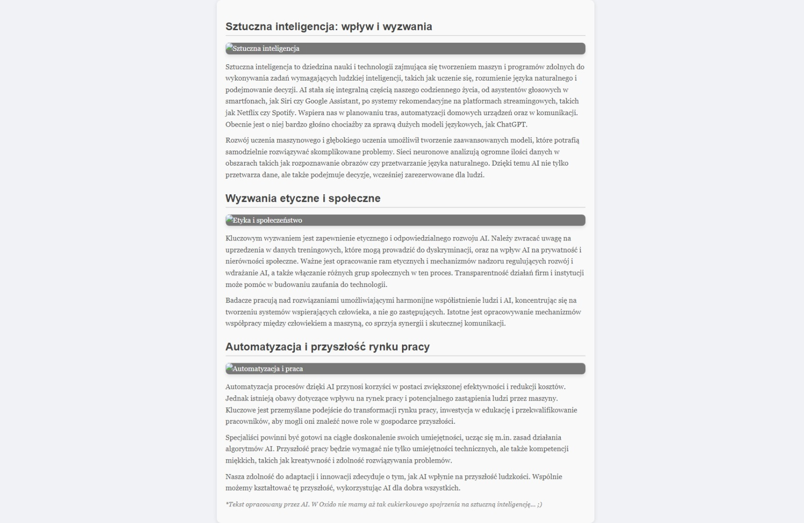

## Jak uruchomić aplikację?
Najpierw należy w folderze projektu utworzyć plik .env i umieścić w nim następującą treść:
```
API_KEY = tutaj należy umieścić swój własny secret key, służący do łączenia się z API OpenAI
```
Następnie należy zainstalować następujące paczki za pomocą komendy:
```
pip install openai python-dotenv beautifulsoup4
```

Należy w konsoli wpisać:
```
python main.py
```
Lub w przypadku PyCharm nacisnąć kombinacje klawiszy ___Shift+F10___.

## Działanie aplikacji:
Aplikacja składa się z trzech funkcji:
+ read_file - odczytuje zawartość pliku _tresc_artykulu_._txt_
+ generate_html - łączy się z API OpenAI i wysyła promptu wraz z treścią pliku .txt
+ add_to_html - dodaje otrzymaną z API odpowiedź do kodu HTML i zapisuje ją w pliku _podglad.html_

Aplikacja wykorzystuje zawartość pliku szablon.html do utworzenia poprawnego pliku HTML, sam szablon zawiera w
sekcji head znacznik <style&gt; - służący do wystylizowania odpowiednich tagów HTML.

Aplikacja na zakończenie wyświetla w konsoli napis: _Utworzono plik 'podglad.html'._
Poniżej znajduje się screenshot utworoznego pliku podglad.html otwartego w przeglądarce.
